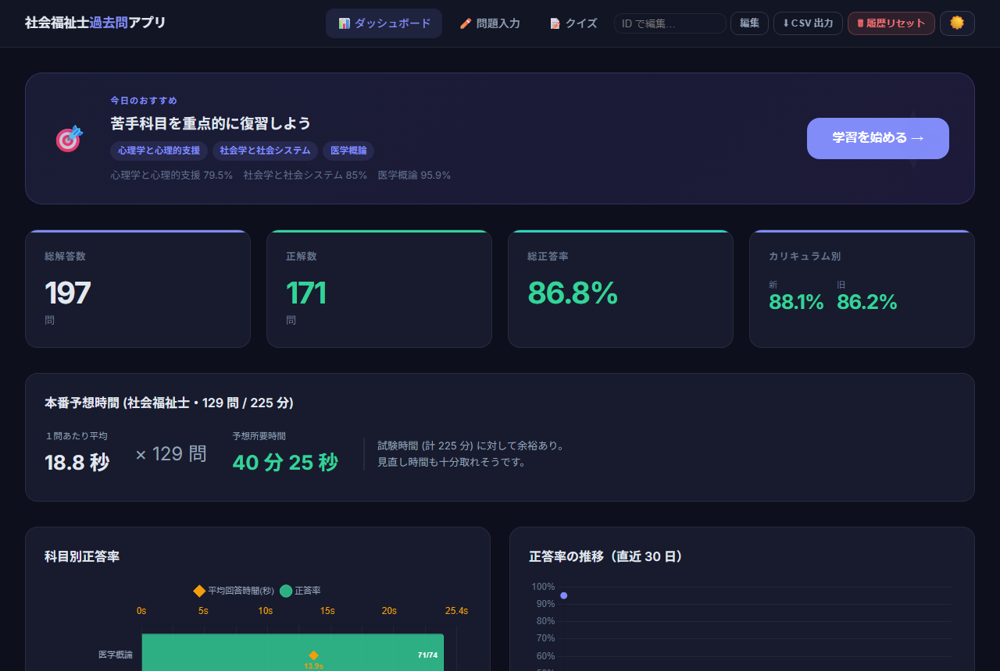
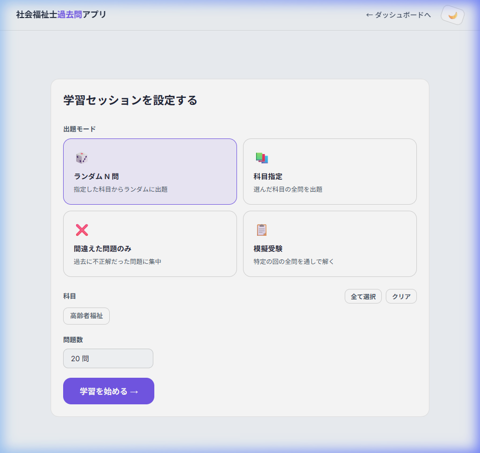
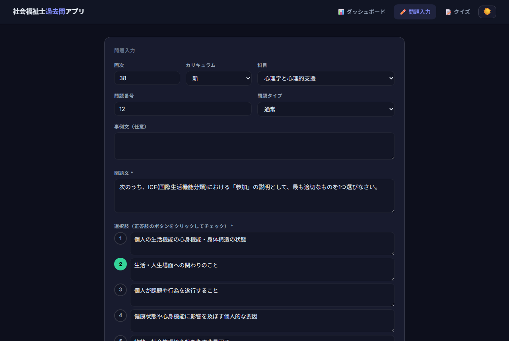

# 社会福祉士過去問アプリ

過去問を解いて、AI に解説を書いてもらって、繰り返し復習する。それだけの個人学習ツールです。

## これは何？

社会福祉士国家試験の過去問をブラウザで繰り返し解けるアプリです。解答履歴が自動で記録され、苦手な科目や問題がダッシュボードに表示されます。問題データはお手元で入力していただく形式で、プログラミングの知識は不要です。

> **紹介記事**: 開発の経緯やコンセプトは note の紹介記事 [「便利すぎる時代に、あえて『手間のかかる』過去問アプリを自作した話」](https://note.com/probono_a/n/nf56644063825) をご覧ください。

> **データについて**: 本リポジトリに問題データは含まれていません。下記の手順に沿って、ご自身で問題を入力してください。

> **他の過去問アプリとの違い**: 問題が最初から入っている過去問アプリ（Web サイトやスマホアプリ）はすでにいくつも配布されています。手軽に過去問を解きたいだけなら、そちらを使うほうが早いです。本アプリはあえて「自分で問題と解説を入力する」という一手間を挟むことで、記憶への定着＝学習効果を高めることを狙いとしたツールです。

> **他の資格試験にも応用できます**: 仕組みは「問題・選択肢・解説を入力して、繰り返し解いて、苦手を見える化する」というだけの汎用的なものです。ただし、科目の一覧や新旧カリキュラムの区分、問題 ID の体系（`回次_問題番号`）、AI 解説依頼文の文言などは社会福祉士向けに作ってあるため、他の資格試験で使うにはちょっとした改修が必要です。

---

## スクリーンショット

| ダッシュボード（ダークモード） | クイズ画面（ライトモード） | 問題入力画面 |
| --- | --- | --- |
|  |  |  |

---

## 使い方

### ステップ 1: Python と uv をインストールする（初回のみ）

1. [Python 公式サイト](https://www.python.org/downloads/)から Python 3.11 以上をダウンロードしてインストールします。インストール時に「Add python.exe to PATH」にチェックを入れてください。
  
2. コマンドプロンプトまたは PowerShell を開き、以下を実行して `uv` をインストールします。
  

```
pip install uv
```

### ステップ 2: アプリを入手する（初回のみ）

1. このページ上部の緑色の **Code** ボタン → **Download ZIP** をクリックします。
2. ダウンロードした ZIP ファイルを、デスクトップなど分かりやすい場所に展開（解凍）します。

### ステップ 3: セットアップして起動する（初回のみ）

1. 展開したフォルダの中にある `setup.bat` をダブルクリックします。黒い画面が表示され、セットアップが進みます。「セットアップが完了しました」と表示されたら、何かキーを押して閉じます。
  
2. 同じフォルダの `run.bat` をダブルクリックします。サーバーが起動したままの状態になり、数秒後に自動でブラウザが開いてダッシュボード画面が表示されます。（この画面は閉じずに残しておいてください。）
  


自動で開かない場合は、ブラウザのアドレスバーに次の URL を入力してアクセスしてください。

```
http://localhost:8000/
```

> 2 回目以降は `run.bat` をダブルクリックするだけで起動できます。（`setup.bat` は初回のみで OK です。）  
> サーバーを止めたいときは `run.bat` の黒い画面を閉じるか、`stop.bat` を実行してください。

### ステップ 4: 問題を入力する

まだ問題データが 1 つもない状態なので、まずは過去問を入力しましょう。画面上部の **「✏️ 問題入力」** から入力フォームを開き、過去問を見ながら入力します。（詳しくは下記「問題の入力方法」）

### ステップ 5: クイズで復習する

画面上部の **「📝 クイズ」** から出題モードを選んで、解いた問題を復習できます。ダッシュボードでは正答率や苦手科目が自動集計されます。

---

## 問題の入力方法（詳細）

1. 画面上部の **「✏️ 問題入力」** を開きます。
  
2. お手元の過去問を見ながら、回次・科目・問題文・選択肢・正解を入力します。過去問 PDF は試験団体のサイトから入手できます。
   - [社会福祉振興・試験センター（過去の試験問題）](https://www.sssc.or.jp/shakai/past_exam/index.html)
   - [日本社会福祉教育学校連盟（国家試験情報）](https://jaswe.jp/kokushiinfo.html)
  
3. 選択肢の左にある番号ボタンをクリックすると、正解としてチェックが付きます（複数正解の問題は 2 つクリックしてください）。
  
4. **解説**は自分で書く代わりに、AI チャットに書いてもらうこともできます😁。問題文と選択肢を入力したら選択肢欄の下にある **「📋 AI 解説依頼文をコピー」** ボタンを押すと、入力済みの内容を組み込んだ依頼文が自動でクリップボードにコピーされます。それを Gemini や ChatGPT などに貼り付けて、返ってきた文章をそのまま解説欄にコピペするだけです。解説欄は Markdown（見出し・太字・箇条書き・表）に対応しており、「プレビュー」タブで表示を確認できます。
   > ⚠️ AI は間違った内容を自信満々に答えることがあります。保存する前に、必ず内容が正しいか自分の目で確認してください。

5. **キーワード**を入れておくと、クイズの解答後にそのキーワードで Google 検索できるリンクが自動で表示されます。
  
6. **参考リンク**に復習に使うサイトの URL を入れておくと、クイズの解答後にページのタイトル・説明付きのリンクカードとして表示されます。
  
7. 入力し終えたら「保存する」をクリックします。保存に成功するとフォームがリセットされ、続けて次の問題を入力できます。解説は空欄のままでも保存できるので、あとから書き足すこともできます。

---

## 登録済みの問題を修正する

修正の入り口は 2 つあります。

- **ダッシュボードの「ID で編集」欄** — 問題 ID（`回次_問題番号`、例: `38_1`）を入力すると編集画面が開きます。保存するとダッシュボードに戻ります。
- **クイズで解答した直後の「✏️ 編集」ボタン** — 誤字や解説の間違いに気づいたら、その場で押すと編集画面が別のタブで開きます。保存するとタブが自動で閉じて、続きからクイズを再開できます（進行中のクイズはそのまま残ります）。

---

## よくある質問

**Q. `run.bat` を実行してもブラウザが自動で開きません。**  
A. サーバー起動から数秒後に自動で開きます。それでも開かない場合は、ブラウザで `http://localhost:8000/` を手入力（またはブックマーク）してアクセスしてください。

**Q. サーバーが起動しない・エラーが出る。**  
A. `setup.bat` を実行し忘れていないか確認してください。また、別のアプリがポート 8000 を使用している場合があります。`stop.bat` を実行してから `run.bat` を再度実行してください。

**Q. ダッシュボードに「データがありません」と表示される。**  
A. まだ問題が 1 問も登録されていない状態です。「問題の入力方法」を参考に、まず何問か登録してください。

**Q. 問題を削除したい。**  
A. 現在、画面から問題を削除する機能はありません。誤って登録した場合は「ID で編集」から内容を修正してください。

---

## 開発者向け

ここから先は、コマンドラインや Git に慣れている方向けの情報です。

### PDF から一括で問題データを作成したい場合

`converter/` のスクリプト群と Claude Code を使って、PDF/HTML の過去問を一括でデータ化できます。手順は [docs/data-pipeline.md](docs/data-pipeline.md) を参照してください。

### Linux での起動

```bash
chmod +x *.sh
./setup.sh   # 初回のみ
./run.sh
```

### プロジェクト構成

```
shakaifukushi-quiz/
├── main.py                     # FastAPI エントリーポイント
├── db.py                       # SQLite 接続ヘルパー
├── routers/
│   ├── questions.py            # /api/subjects, /api/editions, /api/questions
│   ├── sessions.py             # POST /api/sessions, PATCH /api/sessions/{id}
│   ├── history.py              # POST /api/history, GET /api/history/export
│   ├── stats.py                # GET /api/stats
│   ├── recommend.py            # GET /api/recommend
│   └── link_preview.py         # GET /api/link-preview
├── static/
│   ├── index.html              # ダッシュボード
│   ├── quiz.html                # クイズ画面
│   ├── editor.html              # 問題入力フォーム
│   ├── css/style.css           # デザインシステム（ダーク / ライトモード対応）
│   └── js/
│       ├── api.js              # 共通 API クライアント
│       ├── theme.js            # ライト / ダークモード切り替え
│       ├── markdown.js         # 簡易 Markdown レンダラー
│       ├── sound.js            # 効果音
│       ├── dashboard.js        # ダッシュボード描画
│       ├── quiz.js             # クイズ全フロー
│       └── editor.js           # 問題入力フォームのロジック
├── converter/                   # データパイプライン用スクリプト（詳細は docs/data-pipeline.md）
├── tools/
│   └── quiz_editor.html        # JSON 確認・修正 GUI（データパイプライン用）
├── data/                        # SQLite DB・PDF・JSON（すべて Git 管理外）
├── docs/
│   ├── data-pipeline.md        # データパイプラインの詳細ガイド
│   ├── screenshots/            # README 用スクリーンショット
│   └── dev/                    # 開発・内部ドキュメント
├── setup.bat / setup.sh         # 初回セットアップ
├── run.bat / run.sh             # アプリ起動
└── stop.bat / stop.sh           # プロセス強制終了
```

### API エンドポイント一覧

| メソッド | パス | 説明 |
| --- | --- | --- |
| GET | `/api/subjects` | 科目一覧 |
| GET | `/api/editions` | エディション（回号）一覧 |
| GET | `/api/questions` | 問題取得（モード・科目・問題数でフィルタ） |
| GET | `/api/questions/{id}` | 問題 1 件取得 |
| POST | `/api/questions` | 問題の新規登録 |
| PUT | `/api/questions/{id}` | 問題の編集 |
| POST | `/api/sessions` | セッション作成 |
| PATCH | `/api/sessions/{id}` | セッション終了 |
| POST | `/api/history` | 解答記録 |
| GET | `/api/history/export` | 学習履歴 CSV ダウンロード |
| GET | `/api/stats` | ダッシュボード用統計データ |
| GET | `/api/recommend` | 今日のおすすめセッション |
| GET | `/api/link-preview` | 参考リンクのプレビュー情報取得 |

API ドキュメント（Swagger UI）はサーバー起動中に [http://localhost:8000/docs](http://localhost:8000/docs) で確認できます。

---

## CSV エクスポートと AI 分析

ダッシュボードの **「⬇ CSV 出力」** ボタンで学習記録を CSV にダウンロードできます。  
Gemini や Claude などに CSV を添付して「弱点を分析してください」と聞くと、より詳細なフィードバックが得られます。

---

## ライセンス

[PolyForm Noncommercial License 1.0.0](LICENSE) — 非商用利用のみ許可されています。

効果音は [OtoLogic](https://otologic.jp) の素材を使用しています（[CC BY 4.0](https://creativecommons.org/licenses/by/4.0/deed.ja)）。

---

## ⚠️ 注意事項

- 本アプリは個人学習目的のツールです。
- ライセンス上、商用利用は許可されていません。（詳細は [LICENSE](LICENSE) を参照）大規模なデータ収集にも使用しないでください。
- 問題データの著作権は各権利者に帰属します。（本アプリのライセンスとは別に、各試験団体の著作権が適用されます。）
- データの再配布はしないでください。
- 外部サーバーへの通信は行いません。（フォント・Chart.js は CDN を使用）
